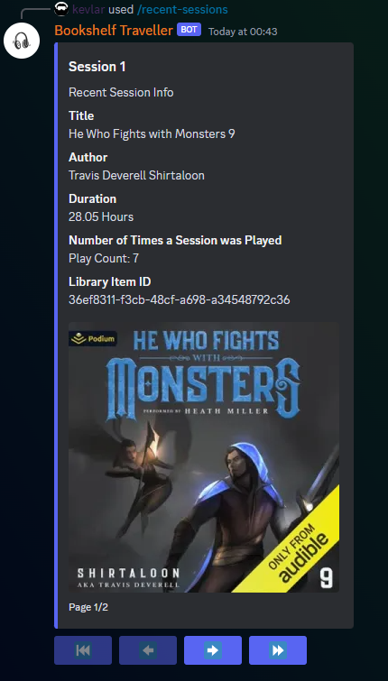
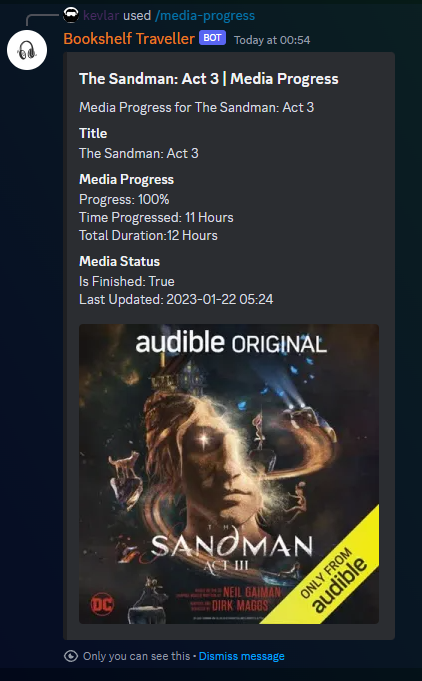
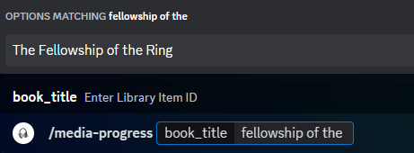

# Bookshelf Traveller


<a href="https://www.buymeacoffee.com/donkevlar" target="_blank"></a>

**Now in Beta! The commands are feature complete, but you may still encounter errors. If you do please raise an issue.**

A fully featured Audiobookshelf discord bot with playback and administrative functionality. Enjoy your travels! :)

You'll need to create your own discord application in order to do this, this is fairly straight forward, here is a guide:

[Create a Discord App - Getting Started](https://discord.com/developers/docs/getting-started#step-1-creating-an-app)

Make sure that you select all intents when setting up your bot and that you have created a url to add it to your desired discord server.
### Known Limitations
**Podcast playback is currently not supported due to the many differences in pulling the audio sources.**

**Ownership by default will allow you to run all commands, to disable this, use the env variable `OWNER_ONLY`.**

**When using commands that use images, i.e. `/media_progress` or `/recent_sessions`, 
the server must use an `HTTPS` connection due to a requirement from discord's API. If not, no image will be generated.**

**Important note regarding `HTTPS` connections. I've experienced a lot of issues when streaming audio from my server to discord using a https connection as the source. I have yet to confirm if this is a double NAT issue, a reverse proxy issue or otherwise. I suggest you utilize a direct connection to your server i.e. `http://127.0.0.1:13378` if you intend to listen to an audiobook for more than 15 minutes at a time.**  

### Environmental Variables


| ENV Variables      | Description                                                                                                                                                | Type      | Required? |
|--------------------|------------------------------------------------------------------------------------------------------------------------------------------------------------|-----------|-----------|
| `DISCORD_TOKEN`    | Discord API Token                                                                                                                                          | *String*  | **YES**   |
| `bookshelfToken`   | Bookshelf User Token (All user types work, but some will limit your interaction options.)                                                                  | *String*  | **YES**   |
| `bookshelfURL`     | Bookshelf url with protocol and port, ex: http://localhost:80                                                                                              | *String*  | **YES**   |
| `PLAYBACK_ROLE`    | A discord role id, used if you want other users to have access to playback.                                                                                | *Integer* | **NO**    |
| `OWNER_ONLY`       | By default set to `True`. Only allow bot owner to use bot.                                                                                                 | *Boolean* | **NO**    |
| `EPHEMERAL_OUTPUT` | By default set to `True`, this sets all commands to ephemeral (shown only to you)                                                                          | *Boolean* | **NO**    |
| `MULTI_USER`       | By default set to `True`, disable this to re-enable admin controls (Conditional on the user logged in.) and to remove the /login and /select options       | *Boolean* | **NO**    |
| `AUDIO_ENABLED`    | By default set to `True`, disable if you want to remove the ability for audio playback.                                                                    | *Boolean* | **NO**    |
| `OPT_IMAGE_URL`    | Optional HTTPS URL for generating cover images and sending them to the discord API. This is primarily if you experience similar issues as mentioned above. | *String*  | **NO**    |
| `TIMEZONE`         | Default set to `America/Toronto`                                                                                                                           | *String*  | **NO**    |
| `DEFAULT_PROVIDER` | Experimental, set the default search provider for certain commands.                                                                                        | *String*  | **NO**    |

## Installation
**Current Installation method is by docker container, however, you can also run main.py within a project folder.**

### Docker Container
Docker Container Available:

#### Docker Hub

```
docker pull donkevlar/bookshelf-traveller:latest
```

#### GitHub Package Repository
```
docker pull ghcr.io/donkevlar/bookshelf-traveller:master
```

To run the container, paste the following command:
```
docker run -d \
--name bookshelf-traveller \
-e DISCORD_TOKEN="INSERT_TOKEN" \
-e bookshelfToken="INSERT_TOKEN" \
-e bookshelfURL="http://myurl.domain.com" \
donkevlar/bookshelf-traveller:latest
```

or using docker compose:

```
version: '3.8'  # Specify the version of the Compose file format

services:
  bookshelf-traveller:
    image: donkevlar/bookshelf-traveller:latest
    container_name: bookshelf-traveller
    environment:
      - DISCORD_TOKEN=INSERT_TOKEN
      - bookshelfToken=INSERT_TOKEN
      - bookshelfURL=http://myurl.domain.com
    restart: always  # Optional: ensures the container restarts on failure or system reboot
    detach: true    # Optional: runs the container in detached mode
```

### Unraid
Visit the community applications (CA) store and search for the template name listed below, click install and insert your discord and ABS tokens respectively and enjoy! 

*Template Name:* `Bookshelf-Traveller`

### Python Script
Requirements: **Python 3.10 or above**.

**FFMPEG Must be installed in the project directory and/or in PATH to run audio commands using the script installation method. If this is too difficult, please use the docker instructions above.**

[FFMPEG](https://www.ffmpeg.org/download.html)

you'll also need an '.env' file for loading the above [ENV Variables](https://github.com/donkevlar/Bookshelf-Traveller/blob/master/README.md#environmental-variables)

*Disclaimer: When installing via git clone, I assume that you are knowledgeable enough to execute the script. I suggest you use a virtual environment when doing so.*

#### Step 1: Navigate to Directory
Open your terminal and navigate to your desired folder. 

#### Step 2: Clone Project
Git clone the project
```
git clone https://github.com/donkevlar/Bookshelf-Traveller.git
```
#### Step 3: Download Dependencies 

*Windows*
```
pip install discord-py-interactions && pip install discord.py-interactions[voice] && pip install python-dotenv && pip install requests
```
*Linux Debian/Ubuntu*

For all os options visit [Interactions.py](https://interactions-py.github.io/interactions.py/Guides/23%20Voice/#__tabbed_1_2)
```
pip install discord-py-interactions && pip install discord.py-interactions[voice] && pip install python-dotenv && pip install requests
```
```
sudo apt install ffmpeg libffi-dev libnacl-dev
```

#### Step 4: Start 
Make sure that you are in the `/Bookshelf-Traveller` directory.
```
python main.py
```
## Bot Commands
The following Commands are available:

**By default, setup as '/' commands, or a.k.a. app commands**
Here's the list of commands sorted alphabetically:

| Command            | Description                                                                                                | Arguments                                          | Additional Information                                                                                                                                                                                                | Additional Functionality                                                                                                     |
|--------------------|------------------------------------------------------------------------------------------------------------|----------------------------------------------------|-----------------------------------------------------------------------------------------------------------------------------------------------------------------------------------------------------------------------|------------------------------------------------------------------------------------------------------------------------------|
| `/active-task`     | Pulls all active tasks, this is a server wide command. (Sees all users, channels, etc)                     |                                                    |                                                                                                                                                                                                                       |                                                                                                                              |
| `/add-user`        | Will create a user, requires username, password                                                            | `name`, `password`, `user_type`, optional: `email` | only with ABS admin token. Otherwise disabled. *MULTI_USER must be False.                                                                                                                                             |
| `/all-libraries`   | Displays all current libraries with their ID                                                               |                                                    |                                                                                                                                                                                                                       |
| `/book-list-csv`   | Get complete list of items in a given library, outputs a csv                                               | `libraryid`                                        | only with ABS admin token. Otherwise disabled. *MULTI_USER must be False.                                                                                                                                             | **Autocomplete Enabled & Cover Images**                                                                                      |
| `/change-chapter`  | Changes chapter in currently playing audio                                                                 | `type`: `next`, `previous`                         |                                                                                                                                                                                                                       |
| `/listening-stats` | Pulls your total listening time                                                                            |                                                    |                                                                                                                                                                                                                       |
| `/login`           | Login using ABS username and password.                                                                     | `username`, `password`                             |                                                                                                                                                                                                                       |
| `/media-progress`  | Searches for the media item's progress                                                                     | `book_title`                                       | Features autocomplete, simply type in the name of the book and it will return the name and ID for you.                                                                                                                | **Autocomplete Enabled & Cover Images**                                                                                      |
| `/new-book-check`  | Will lookback using the given search period for any recently added books. Can be used as a recurring task. | `minutes`, `enable_task`, `disable_task`           | Use the `minutes` argument for a live use case. Note: This does not affect the task timing. Default task is set to refresh every 5 minutes.                                                                           |
| `/pause`           | Pause audio                                                                                                |                                                    |                                                                                                                                                                                                                       |
| `/ping`            | Displays the latency between your server and the discord server shard                                      |                                                    |                                                                                                                                                                                                                       |
| `/play`            | Start a new audio session from server, syncs automatically                                                 | `book_title`                                       |                                                                                                                                                                                                                       | Autocomplete provides up to the last 10 titles you've listened to. Also, Provides a full embedded UI with playback controls. |
| `/recent-sessions` | Will display ***up to*** 10 recent sessions in a filtered and formatted way.                               |                                                    |                                                                                                                                                                                                                       |
| `/resume`          | Resume audio                                                                                               |                                                    |                                                                                                                                                                                                                       |
| `/select`          | Switch between logged in ABS users                                                                         |                                                    |                                                                                                                                                                                                                       |
| `/setup-tasks`     | Used to setup any tasks that are persistent when the bot is running.                                       | `task`, `channel`                                  | Required for all recurring tasks.                                                                                                                                                                                     |
| `/stop`            | Disconnect bot from channel                                                                                |                                                    |                                                                                                                                                                                                                       |
| `/test-connection` | Will test the connection of your bot to the Audiobookshelf server                                          | optional: `opt_url`                                | Optionally you can test the connection to any URL.                                                                                                                                                                    |
| `/user`            | Will display the currently logged in user.                                                                 |                                                    |                                                                                                                                                                                                                       |
| `/user-search`     | Search for a specific user by name                                                                         | `name`                                             | Only with ABS admin token. Current public release only has name, but will be updated to include search by ID, or by using the autocomplete. Only with ABS admin token. Otherwise disabled. *MULTI_USER must be False. | **Autocomplete Enabled**                                                                                                     |
| `/volume`          | Adjusts the bot's volume in the currently connected channel.                                               | `volume`: integer between `0 & 100`                | Default volume is set to 50%.                                                                                                                                                                                         |

### Alternative Packages
Audio-only packages have been deprecated. Please use the environmental variables to modify how you would like your bot to function.
### Screenshots
Below are a few examples of the commands shown above. Note: images are subject to change, or can become outdated as the project is very much active. 

#### /recent-sessions


#### /play


#### /mediaprogress


#### Other examples

