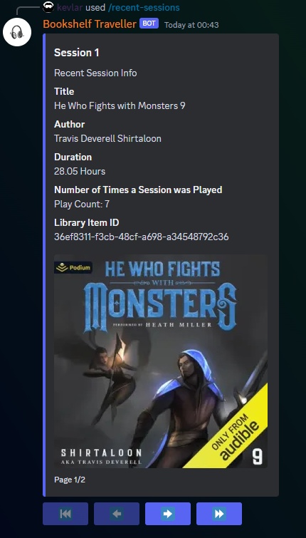
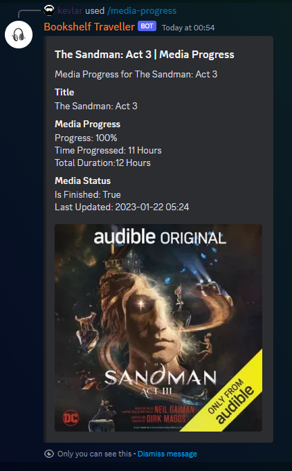
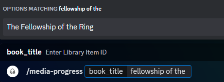

# Bookshelf Traveller


<a href="https://www.buymeacoffee.com/donkevlar" target="_blank"></a>

A fully featured Audiobookshelf discord bot with playback and administrative functionality. Enjoy your travels! :)

You'll need to create your own discord application in order to do this. This is fairly straightforward; here is a guide:

[Create a Discord App - Getting Started](https://discord.com/developers/docs/getting-started#step-1-creating-an-app)

Make sure that you select all intents when setting up your bot and that you have created a URL to add it to your desired discord server.

**If you provide the `CLIENT_ID` environment variable, an invite link will be generated when the bot starts up for you. :)**

Note: To find the CLIENT_ID value, go to the discord developer portal, click on OAUTH2, and under client information you'll see the client id.

**Ownership by default will allow only you to control the bot. To disable this, use the env variable `OWNER_ONLY`.** 

**When using commands that use images, i.e. `/media_progress` or `/recent_sessions`, 
the server must use an `HTTPS` connection due to a requirement from discord's API. If not, no image will be generated.**

**Important note regarding `HTTPS` connections: I've experienced a lot of issues when streaming audio from my server to discord using an https connection as the source. I have yet to confirm if this is a double NAT issue, a reverse proxy issue, or otherwise. I suggest you utilize a direct connection to your server, i.e. `http://127.0.0.1:13378`, if you intend to listen to an audiobook for more than 15 minutes at a time. As a workaround for including images, I've added the `OPT_IMAGE_URL` env variable. If this is utilized (with an https connection), the bot will use this link for all images instead of the initial server URL.**

### Troubleshooting
**Before reporting an issue, please make sure that you enable `DEBUG_MODE=true`. You can use this when reporting an issue as it will describe all backend services and any script-related problems.**

### Environmental Variables


| ENV Variables            | Description                                                                                                                                                | Type      | Required? |
|--------------------------|------------------------------------------------------------------------------------------------------------------------------------------------------------|-----------|-----------|
| `AUDIO_ENABLED`          | By default set to `True`, disable if you want to remove the ability for audio playback.                                                                    | *Boolean* | **NO**    |
| `BOT_ENABLED`            | Enable/disable the Discord bot process (default: `true`).                                                                                                  | *Boolean* | **NO**    |
| `bookshelfToken`         | Bookshelf User Token (All user types work, but some will limit your interaction options.)                                                                  | *String*  | **YES**   |
| `bookshelfURL`           | Bookshelf URL with protocol and port, ex: http://localhost:80                                                                                              | *String*  | **YES**   |
| `CLIENT_ID`              | Discord Bot Client ID (used to generate bot invite link on startup).                                                                                       | *String*  | **NO**    |
| `DB_TYPE`                | Database engine (default: `sqlite`)                                                                                                                       | *String*  | **NO**    |
| `DEBUG_MODE`             | By default, set to `False`. It enables verbose logs and also disables all notifications.                                                                   | *Boolean* | **NO**    |
| `DEFAULT_PROVIDER`       | Experimental, set the default search provider for wishlist book searches (`audible`, `openlibrary`, etc.).                                               | *String*  | **NO**    |
| `DEFAULT_SERVER_NAME`    | Custom server display name for task notifications (default: `Audiobookshelf`).                                                                             | *String*  | **NO**    |
| `DISCORD_TOKEN`          | Discord API Token                                                                                                                                          | *String*  | **YES**   |
| `EPHEMERAL_OUTPUT`       | By default set to `True`, this sets all commands to be ephemeral (shown only to you).                                                                      | *Boolean* | **NO**    |
| `EXPERIMENTAL`           | Enable experimental bot features (default: `false`).                                                                                                       | *Boolean* | **NO**    |
| `FFMPEG_DEBUG`           | By default, set to `False`. It creates FFmpeg logs inside the appdata folder.                                                                              | *Boolean* | **NO**    |
| `HTTPX_TIMEOUT_CONNECT`  | HTTP client connect timeout in seconds (default: `10.0`).                                                                                                  | *Float*   | **NO**    |
| `HTTPX_TIMEOUT_POOL`     | HTTP client pool timeout in seconds (default: `10.0`).                                                                                                     | *Float*   | **NO**    |
| `HTTPX_TIMEOUT_READ`     | HTTP client read timeout in seconds (default: `60.0`).                                                                                                     | *Float*   | **NO**    |
| `HTTPX_TIMEOUT_WRITE`    | HTTP client write timeout in seconds (default: `10.0`).                                                                                                    | *Float*   | **NO**    |
| `INITIALIZED_MSG`        | Send startup notification DM to bot owner (default: `true`).                                                                                               | *Boolean* | **NO**    |
| `MAX_CONN_ATTEMPT`       | Maximum connection attempts to Audiobookshelf server on startup (default: `10`).                                                                           | *Integer* | **NO**    |
| `MULTI_USER`             | By default set to `True`, disable this to re-enable admin controls (conditional on the user logged in) and to remove the /login and /select options.       | *Boolean* | **NO**    |
| `OPT_IMAGE_URL`          | Optional HTTPS URL for generating cover images and sending them to the discord API.                                                                       | *String*  | **NO**    |
| `OWNER_ONLY`             | By default set to `True`. Only allow bot owner or role owners (if enabled) to use the bot.                                                                 | *Boolean* | **NO**    |
| `PLAYBACK_ROLE`          | A discord role ID, used if you want other users to have access to playback.                                                                                | *Integer* | **NO**    |
| `TASK_FREQUENCY`         | Interval in minutes for background subscription tasks (default: `5`).                                                                                      | *Integer* | **NO**    |
| `TIMEZONE`               | Default set to `America/Toronto`                                                                                                                           | *String*  | **NO**    |
| `UPDATES`                | Playback session sync interval in seconds (default: `5`).                                                                                                  | *Integer* | **NO**    |
| `WEBUI_ENABLED`          | Enable/disable the Web Management Interface (default: `true`).                                                                                             | *Boolean* | **NO**    |
| `WEBUI_HOST`             | Web UI host binding (default: `0.0.0.0`).                                                                                                                  | *String*  | **NO**    |
| `WEBUI_PORT`             | Web UI listening port (default: `8080`).                                                                                                                   | *Integer* | **NO**    |

### Web Management UI

Bookshelf Traveller includes a built-in Web Management Interface powered by FastAPI.
- **Default Dashboard URL**: `http://localhost:8080`
- **Features**: View bot & Audiobookshelf connection status, test server connections, and configure application settings live without restarting.

### Database Configuration

The bot uses SQLite for local database storage. No additional database server configuration is needed. Database files are automatically initialized and stored in the `db/` directory.

## Installation
**Current installation method is by docker container; however, you can also run main.py within a project folder.**

### Docker Container
Docker Container Available:

#### Docker Hub

```
docker pull donkevlar/bookshelf-traveller:latest
```

#### GitHub Package Repository
```
docker pull ghcr.io/donkevlar/bookshelf-traveller:master
```

To run the container, paste the following command:
```
docker run -d \
--name bookshelf-traveller \
-e DISCORD_TOKEN="INSERT_TOKEN" \
-e bookshelfToken="INSERT_TOKEN" \
-e bookshelfURL="http://myurl.domain.com" \
-e CLIENT_ID="CLIENTID" \
-e AUDIO_ENABLED="True" \
-e MULTI_USER="false" \
-v ./bookshelf-traveller:/ABSBOT/db \
donkevlar/bookshelf-traveller:latest
```

or using docker compose:

```
services:
  bookshelf-traveller:
    image: donkevlar/bookshelf-traveller:latest
    container_name: bookshelf-traveller
    environment:
      - DISCORD_TOKEN=INSERT_TOKEN
      - bookshelfToken=INSERT_TOKEN
      - bookshelfURL=http://myurl.domain.com
    volumes:
      - ./bookshelf-traveller:/ABSBOT/db
    restart: always
```

### Unraid
Visit the community applications (CA) store and search for the template name listed below, click install and insert your discord and ABS tokens respectively and enjoy! 

*Template Name:* `Bookshelf-Traveller`

### Python Script
Requirements: **Python 3.10 or above**.

**FFmpeg must be installed in the project directory and/or in PATH to run audio commands using the script installation method. If this is too difficult, please use the docker instructions above.**

[FFmpeg](https://www.ffmpeg.org/download.html)

You'll also need a '.env' file for loading the above [ENV Variables](https://github.com/donkevlar/Bookshelf-Traveller/blob/master/README.md#environmental-variables)

#### Step 1: Navigate to Directory
Open your terminal and navigate to your desired folder. 

#### Step 2: Clone Project
Git clone the project
```
git clone https://github.com/donkevlar/Bookshelf-Traveller.git
```
#### Step 3: Download Dependencies 

*Windows*
```
pip install -r requirements.txt
```
*Linux Debian/Ubuntu*

For all OS options visit [Interactions.py](https://interactions-py.github.io/interactions.py/Guides/23%20Voice/#__tabbed_1_2)
```
pip install -r requirements.txt
```
```
sudo apt install ffmpeg libffi-dev libnacl-dev
```

#### Step 4: Start 
Make sure that you are in the `/Bookshelf-Traveller` directory.

To start both the Web UI management dashboard and the Discord bot (Recommended):
```
python launcher.py
```

To start only the Discord bot:
```
python main.py
```

## Running Tests

Bookshelf Traveller includes an automated unit test suite in the `tests/` directory to verify database operations, API integration, and settings.

### Executing the Test Suite

Ensure your dependencies are installed, then run the test discovery command:

```bash
python -m unittest discover -s tests
```

### Test Suite Structure
- **`tests/test_wishlist.py`**: Tests SQLite wishlist database creation, record insertion, downloaded status updates, and queries.
- **`tests/test_subscription_task.py`**: Tests subscription task management, distributed locking (`acquire_lock`/`release_lock`), message deduplication, and version control.
- **`tests/test_multi_user.py`**: Tests user registration, duplicate prevention, Discord ID / token / username searches, and user removals.
- **`tests/test_settings.py`**: Tests environment variable parsing, default settings loading, and string-to-boolean conversions.
- **`tests/test_webui.py`**: Tests FastAPI Web UI dashboard endpoints (`/`, `/api/status`, `/api/config`) and SQLite settings storage.
## Bot Commands
The following commands are available:

**By default, set up as '/' commands, or a.k.a. app commands**
Here's the list of commands sorted alphabetically:

| Command                     | Description                                                                                                | Arguments                                          | Additional Information                                                                                                                                                                                                                        | Additional Functionality                                                                                                     |
|-----------------------------|------------------------------------------------------------------------------------------------------------|----------------------------------------------------|-----------------------------------------------------------------------------------------------------------------------------------------------------------------------------------------------------------------------------------------------|------------------------------------------------------------------------------------------------------------------------------|
| `/active-tasks`             | View active tasks related to you or server-wide active subscription tasks.                                 |                                                    |                                                                                                                                                                                                                                               |                                                                                                                              |
| `/add-book`                 | Add a book to your wishlist, this command is open server-wide.                                             | `title`, `provider`, `force`                       | Most successful searches will appear on audible, but others are available by default. Note that even if a title is specific, sometimes that can result in too many options and the bot returning nothing. Use a series name when this occurs. | **Autocomplete**                                                                                                             |
| `/add-user`                 | Will create a user, requires username, password                                                            | `name`, `password`, `user_type`, optional: `email` | Only with ABS admin token. Otherwise disabled. *MULTI_USER must be False.                                                                                                                                                                     |                                                                                                                              |
| `/all-libraries`            | Displays all current libraries with their ID                                                               |                                                    |                                                                                                                                                                                                                                               |                                                                                                                              |
| `/all-library-items`        | Display or export all items from a specified library.                                                      | `libraryid`                                        |                                                                                                                                                                                                                                               | **Autocomplete Enabled & Cover Images**                                                                                      |
| `/announce`                 | Creates a public announcement card / link for people to join the voice channel                             |                                                    |                                                                                                                                                                                                                                               |                                                                                                                              |
| `/book-list-csv`            | Get complete list of items in a given library, outputs a CSV                                               | `libraryid`                                        | Only with ABS admin token. Otherwise disabled. *MULTI_USER must be False.                                                                                                                                                                     | **Autocomplete Enabled & Cover Images**                                                                                      |
| `/change-chapter`           | Changes chapter in currently playing audio                                                                 | `type`: `next`, `previous`, or chapter number      |                                                                                                                                                                                                                                               |                                                                                                                              |
| `/close-all-sessions`       | Disconnect and close all active audio playback sessions.                                                   |                                                    |                                                                                                                                                                                                                                               |                                                                                                                              |
| `/discover`                 | Provides 10 random books to the user                                                                       |                                                    |                                                                                                                                                                                                                                               |                                                                                                                              |
| `/listening-recap`          | Generate a listening recap summary for a specified timeframe.                              | optional: `days`, `start_date`, `end_date`         | Pulls timeframe listening stats, streaks, peak listening days, top audiobook, author, and genres with cover art.                                                                                              |                                                                                                                              |
| `/listening-stats`          | Pulls your total listening time                                                                            |                                                    |                                                                                                                                                                                                                                               |                                                                                                                              |
| `/login`                    | Login using ABS username and password.                                                                     | `username`, `password`                             |                                                                                                                                                                                                                                               |                                                                                                                              |
| `/media-progress`           | Searches for the media item's progress                                                                     | `book_title`                                       | Features autocomplete, simply type in the name of the book and it will return the name and ID for you.                                                                                                                                        | **Autocomplete Enabled & Cover Images**                                                                                      |
| `/new-book-check`           | Will look back using the given search period for any recently added books. Can be used as a recurring task.| `minutes`, `enable_task`, `disable_task`           | Use the `minutes` argument for a live use case. Note: This does not affect the task timing. Default task is set to refresh every 5 minutes.                                                                                                   |                                                                                                                              |
| `/pause`                    | Pause audio                                                                                                |                                                    |                                                                                                                                                                                                                                               |                                                                                                                              |
| `/ping`                     | Displays the latency between your server and the discord server shard                                      |                                                    |                                                                                                                                                                                                                                               |                                                                                                                              |
| `/play`                     | Start a new audio session from server, syncs automatically                                                 | `book`                                             |                                                                                                                                                                                                                                               | Autocomplete provides up to the last 10 titles you've listened to. Also, provides a full embedded UI with playback controls. |
| `/recent-sessions`          | Will display ***up to*** 10 recent sessions in a filtered and formatted way.                               |                                                    |                                                                                                                                                                                                                                               |                                                                                                                              |
| `/recently-added`           | Will display ***up to*** 10 recently added books.                                                          |                                                    |                                                                                                                                                                                                                                               |                                                                                                                              |
| `/refresh`                  | Refresh play book                                                                                          |                                                    |                                                                                                                                                                                                                                               |                                                                                                                              |
| `/remove-book`              | Mark a book as downloaded in your wishlist                                                                 |                                                    |                                                                                                                                                                                                                                               |                                                                                                                              |
| `/remove-task`              | Remove an active task from the task database.                                                              | `db_id` or `task`                                  |                                                                                                                                                                                                                                               |                                                                                                                              |
| `/remove-user`              | Remove a user from the Bookshelf-Traveller database.                                                       |                                                    |                                                                                                                                                                                                                                               |                                                                                                                              |
| `/resume`                   | Resume audio                                                                                               |                                                    |                                                                                                                                                                                                                                               |                                                                                                                              |
| `/search-book`              | Search for a book across your Audiobookshelf libraries.                                                    | `title`                                            |                                                                                                                                                                                                                                               | **Autocomplete Enabled**                                                                                                     |
| `/select`                   | Switch between logged in ABS users                                                                         |                                                    |                                                                                                                                                                                                                                               |                                                                                                                              |
| `/series-info`              | Show information and book sequence for the current series.                                                 |                                                    |                                                                                                                                                                                                                                               |                                                                                                                              |
| `/setup-default-commands`   | Override optional default command arguments.                                                               |                                                    | Only affects default commands.                                                                                                                                                                                                                |                                                                                                                              |
| `/setup-tasks`              | Used to setup any tasks that are persistent when the bot is running.                                       | `task`, `channel`                                  | Required for all recurring tasks.                                                                                                                                                                                                             |                                                                                                                              |
| `/stop`                     | Disconnect bot from channel                                                                                |                                                    |                                                                                                                                                                                                                                               |                                                                                                                              |
| `/test-connection`          | Will test the connection of your bot to the Audiobookshelf server                                          | optional: `opt_url`                                | Optionally you can test the connection to any URL.                                                                                                                                                                                            |                                                                                                                              |
| `/toggle-podcast-autoplay`  | Toggle automatic podcast episode progression on or off.                                                    |                                                    |                                                                                                                                                                                                                                               |                                                                                                                              |
| `/toggle-series-autoplay`   | Toggle automatic series progression on or off.                                                             |                                                    |                                                                                                                                                                                                                                               |                                                                                                                              |
| `/user`                     | Will display the currently logged in user.                                                                 |                                                    |                                                                                                                                                                                                                                               |                                                                                                                              |
| `/user-search`              | Search for a specific user by name                                                                         | `name`                                             | Only with ABS admin token. Current public release only has name, but will be updated to include search by ID, or by using the autocomplete. Only with ABS admin token. Otherwise disabled. *MULTI_USER must be False.                         | **Autocomplete Enabled**                                                                                                     |
| `/view-all-wishlists`       | View all active or inactive wishlists of all submitted wishlists. Admin/owner command only.                |                                                    |                                                                                                                                                                                                                                               |                                                                                                                              |
| `/volume`                   | Adjusts the bot's volume in the currently connected channel.                                               | `volume`: integer between `0 & 100`                | Default volume is set to 50%.                                                                                                                                                                                                                 |                                                                                                                              |
| `/wishlist`                 | View your wishlist. Server-wide command.                                                                   |                                                    |                                                                                                                                                                                                                                               |                                                                                                                              |

### Alternative Packages
Audio-only packages have been deprecated. Please use the environmental variables to modify how you would like your bot to function.

## Features

#### /play
Play any of your audiobooks directly in discord! This also works with Xbox or Mobile clients. The bot will automatically sync your progress to your ABS server, and allow you to use multiple users from one place!


#### Multi-Channel Notifications (/setup-task)
Monitor and track what is added to your ABS server by utilizing the book check tasks. Select which channels you want the notifications to be subscribed to; multiple channel notifications are supported! 

#### /wishlist
Create a customized wishlist, with direct messages so that your other server members can subscribe to see when something they wishlisted gets added. 


#### /recent-sessions
List your most recent sessions.



#### /mediaprogress
View all of your media's progress at a glance.



#### Other examples
